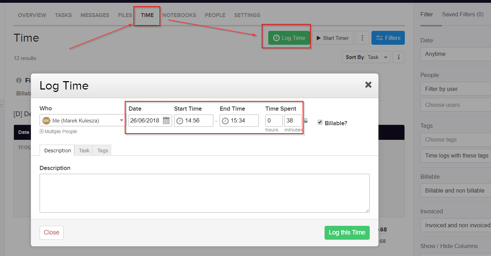

**Pagepro Book**

Handbook for new team members.

[[TOC]]

# Pagepro

## Why Pagepro was created?

We wanted to work on the most interesting projects in the world. To do that we had to build a great team, get specialised and find ideal clients worldwide. We've achieved this and this is helping us to grow. We want to see how our clients winning when we are providing a great value for them thanks to our high specialisation, knowledge and helpfulness. We are delivering high quality code to make their web and mobile platforms work fast, stable with best user experience and be easy to scale.

We are front-end development consultants, trusted by digital leaders worldwide. 

## Pagepro Values

* Most important (in this order):

    * **People**: atmosphere conducive to the development of programmers, effective use of skills,

    * **Projects**: interesting and challenging tasks, new technologies,

    * **Clients**: high-margin clients with a budget for innovations and open to novelties

* Leave the code in a better condition than you received it.

* Help others to develop and take care of the atmosphere which is conducive to learning.

## What is Pagepro good at?

Pagepro specialises in front-end technologies. With this single-minded approach, we aim to become world known experts in specific areas of software development.

**We know how to:**

* Create web apps in JavaScript: **React**

* Create mobile apps: **React Native**

* Convert Web Designs into **HTML/CSS/JS templates**,

* Prepare **mailings & newsletters**,

* Implement **WordPress Websites** & **WooCommerce eCommerce Platforms**

* Create **style guides**

* Prepare **animations**

## What does Pagepro not do?

Pagepro does not provide backend development services. If the client requires this type of work, Pagepro takes subcontractors, usually external companies to perform the task.

### Typical subcontractor tasks

We have local partners and we are happy to introduce them to our clients. List of our partners we can rely on:

* Python Backend Development

* .NET Backend Development

* JAVA Backend Development

* Ruby / RoR Backend Development

* iOS Mobile Development

* Android Mobile Development

* UI & UX Design

## How to write our company name?

Correct: Pagepro

Wrong: PagePro

Wrong: Page pro

## Cooperation models

1. **Team argumentation** - we are a part of the client’s team. Some of our specialists participate in the project managed by the client. We settle every month based on the hourly report. [Read more about it.](https://insights.daffodilsw.com/blog/team-augmentation-vs-project-outsourcing-for-software-development)

2. **Time & Material (T&M) projects** - We manage the project and estimate it before the start but the estimates are not binding. We implement the project and settle every month based on the hourly report. [Read more about it.](https://rubygarage.org/blog/time-and-material-model)

3. **Fixed price & budget projects** - We estimate the time and budget of the project in advance. Then we divide the project into stages and settle after reaching a given stage. We have to make the project on time and stay within budget because otherwise, the company does not earn or pays contractual penalties. [Read more about it.](https://medium.com/@Eugeniya/time-and-materials-vs-fixed-price-which-to-choose-for-your-project-11dc6adc758b)

4. **Bodyleasing** - Companies, mostly big agencies or software houses, hire our developers. We settle monthly based on an hourly report. [Read more about it.](http://www.pmi-soft.com/what-is-body-leasing/)

## ICP -  Ideal Client Profiles

<table>
  <tr>
    <td></td>
    <th>React Department</th>
    <th>Front-end Department</th>
    <th>WordPress Department</th>
  </tr>
  <tr>
    <td>Regions or countries</td>
    <td>UK, US, Western Europe</td>
    <td>UK, Western Europe, Australia</td>
    <td>UK, US, Western Europe, Australia</td>
  </tr>
  <tr>
    <td>Industry</td>
    <td>Computer Software</td>
    <td>Creative</td>
    <td>Creative</td>
  </tr>
  <tr>
    <td>Verticals</td>
    <td>Web Platform / Dashboard</td>
    <td>Web platform / Dashboard / Corporate Website</td>
    <td>Design & Development Digital Agency</td>
  </tr>
  <tr>
    <td>Tech stack</td>
    <td>React, Redux, TypeScript</td>
    <td>HTML5, CSS3, ES6, jQuery, WordPress</td>
    <td>WordPress</td>
  </tr>
  <tr>
    <td>Company type</td>
    <td>Firm / Startup</td>
    <td>Digital / Creative Agency</td>
    <td>Digital / Creative Agency</td>
  </tr>
  <tr>
    <td>Size (min. # employees)</td>
    <td>11-50 employees</td>
    <td>1-10 employees</td>
    <td>1-10 employees</td>
  </tr>
  <tr>
    <td>Size (max. # employees)</td>
    <td>51-200 employees</td>
    <td>51-200 employees</td>
    <td>11-50 employees</td>
  </tr>
  <tr>
    <td>Comments</td>
    <td>- happy to pay deposit
- payments on time
- over hours paid +50%
- respects Polish bank holidays
- happy to update hourly rate every 6 months
- okay with working / speaking in our time zone
- looking for a long term partner</td>
    <td>- happy to pay deposit (50% for fixed price project)
- payments on time
- over hours paid +50%
- respects Polish bank holidays
- happy to update hourly rate every 6 months
- okay with working / speaking in our time zone
- looking for a long term partner</td>
    <td>- happy to pay deposit
- payments on time
- over hours paid +50%
- respects Polish bank holidays
- happy to update hourly rate every 6 months
- okay with working / speaking in our time zone
- looking for a long term partner</td>
  </tr>
  <tr>
    <td>Business requirements</td>
    <td></td>
    <td></td>
    <td></td>
  </tr>
  <tr>
    <td>Minimum commitment</td>
    <td>3 developers full time for at least 3 months</td>
    <td>1 developer, minimum 160 hours</td>
    <td>Project budget £4500 (150 working hours)</td>
  </tr>
  <tr>
    <td>Extra points</td>
    <td></td>
    <td></td>
    <td></td>
  </tr>
  <tr>
    <td>Funding / investors</td>
    <td>Does a company had at least 100k USD funding last year?</td>
    <td>-</td>
    <td>-</td>
  </tr>
  <tr>
    <td>Company growth</td>
    <td>Is the company growth more than 50%? (measure LinkedIn employee growth over last year)?</td>
    <td>-</td>
    <td>-</td>
  </tr>
  <tr>
    <td>Street credit</td>
    <td>-</td>
    <td>Has the company won any CSS Awards? Web Design Awards?</td>
    <td>Has the company won any CSS Awards? Web Design Awards?</td>
  </tr>
  <tr>
    <td>Call</td>
    <td>Did we had a great call with them?</td>
    <td>Did we had a great call with them?</td>
    <td>Did we had a great call with them?</td>
  </tr>
  <tr>
    <td>Ideal contact(s)</td>
    <td></td>
    <td></td>
    <td></td>
  </tr>
  <tr>
    <td>Decision Makers</td>
    <td>- Development Director
- CTO
- Lead Developer
- Lead Architect</td>
    <td>- CEO
- Lead Designer
- Lead Developer
- CTO</td>
    <td>- CEO
- Lead Designer</td>
  </tr>
  <tr>
    <td>KPIs</td>
    <td>- developing tech strategy for the company
- managing development team
- delivering high quality software on time
- having required dev team capacity
- choosing right technology for the business</td>
    <td>- preparing branding & designs for clients
- getting requirements for the projects
- estimating the projects
- preparing functional specifications for the projects
- managing designers & developers
- preparing UX & UI designs
- delivering websites / WordPress projects</td>
    <td>- preparing branding & designs for clients
- getting requirements for the projects
- estimating the projects
- preparing functional specifications for the projects
- managing designers & developers
- preparing UX & UI designs
- delivering websites / WordPress projects</td>
  </tr>
  <tr>
    <td>Our value prop</td>
    <td>- available React developers to start right away
- experienced and responsible React Developers
- easy to manage / adaptable React Developers
- we can also provide UI Developers to make sure app looks great
- we can also provide React Native developers to build mobile app</td>
    <td>- available FE developers to start right away
- experienced and responsible FE Developers
- easy to manage / adaptable FE Developers
- we can also provide WP developers to help</td>
    <td>- available WP developers to start right away
- experienced and responsible WP Developers
- easy to manage / adaptable WP Developers
- we can also provide FE developers to help</td>
  </tr>
  <tr>
    <td>Influencers</td>
    <td>- developers in his team
- competition / industry standards</td>
    <td>- developers in his team</td>
    <td>- developers in his team</td>
  </tr>
  <tr>
    <td>Skills</td>
    <td>- technical / programming skills
- management skills
- long experience in IT</td>
    <td>- UX / UI design skills
- Project Management skills
- WordPress usage skills</td>
    <td>- UX / UI design skills
- Project Management skills
- WordPress usage skills</td>
  </tr>
  <tr>
    <td>Reports to</td>
    <td>CEO</td>
    <td>CEO</td>
    <td>CEO</td>
  </tr>
  <tr>
    <td>Manage</td>
    <td>- tech development team</td>
    <td>- designers team</td>
    <td>- designers team</td>
  </tr>
  <tr>
    <td>Comments</td>
    <td></td>
    <td></td>
    <td></td>
  </tr>
  <tr>
    <td>Research steps</td>
    <td></td>
    <td></td>
    <td></td>
  </tr>
  <tr>
    <td>Product & Entry points</td>
    <td></td>
    <td></td>
    <td></td>
  </tr>
  <tr>
    <td>Product/Service Interest</td>
    <td>Team argumentation / remote team / outsourcing</td>
    <td>Design to HTML&CSS</td>
    <td>Design to WordPress Website implementation - Fix time & budget project or T&M project</td>
  </tr>
  <tr>
    <td>Ideal Pains</td>
    <td>- lack of highly skilled React Developers
- can't recruit and retain developers in highly competitive market
- understaffed -> need of 3 devs</td>
    <td>- do not have any tech team at all or doesn't have enough capacity
- his developers are full stack developers and the project looks bad after implementation</td>
    <td>- do not have any tech team at all or doesn't have enough capacity</td>
  </tr>
  <tr>
    <td>Value propositions</td>
    <td>Experienced, well trained, friendly developers</td>
    <td>Experienced, well trained, friendly developers</td>
    <td>Experienced, well trained, friendly developers</td>
  </tr>
  <tr>
    <td>How strong is your product</td>
    <td>Vitamin</td>
    <td>Vitamin</td>
    <td>Vitamin</td>
  </tr>
  <tr>
    <td>Need to switch from other solution</td>
    <td>No</td>
    <td>No</td>
    <td>No</td>
  </tr>
  <tr>
    <td>Deal breakers</td>
    <td>- Lack of trust for external vendor
- More affordable prices in competition</td>
    <td>- Lack of trust for external vendor
- More affordable prices in competition
- Different pricing models between us and client and his clients</td>
    <td>- Lack of trust for external vendor
- More affordable prices in competition
- Different pricing models between us and client and his clients</td>
  </tr>
</table>

## Operations

### Email

We use Gmail for our email.

### Calendar

We use Google Calendar for our calendars.

### Documents

We use Google Docs for our editable documents.

We prefer Google Docs because they are:

* Easily shareable by URL. Everyone has a browser, not everyone has MS-Office or OpenOffice installed.

* Always up to date with the latest edits.

* Enable real-time collaboration, like group meeting notes.

* Autosaved to the cloud, so no worrying about backup.

* Are as easy to find as Googling something.

* Without document type versioning (e.g. xls vs. xlsx).

#### Google Slides Template:

https://docs.google.com/presentation/d/159FMtyUbtkSQjKkuSnNIteroOzII7RAt-0SFnIR3VXs/edit#slide=id.ge0d554001_0_0

### Meetings

We use [Google Hangouts](http://www.google.com/+/learnmore/hangouts/) and [Uber Conference](https://www.uberconference.com/) for the meetings.

# Prepare for the position of a FE Developer

What can you do before your first day at work?

* Get familiar with [LibSasserplate](https://github.com/Pagepro/libsasserplate)

    * Install it

    * Look at files structure

    * Check where the variables are defined

    * Check the list of Gulp commands

    * See how classes are named and how files are arranged in **TPL**

* Get familiar with [http://atomic.prvsrv.com/](http://atomic.prvsrv.com/) 

* Read the document for component naming: [https://docs.google.com/document/d/1rFw2nlvBbS92yEPE0RWJ94rdAsbdFHnMFXBLrdOMaUY/edit](https://docs.google.com/document/d/1rFw2nlvBbS92yEPE0RWJ94rdAsbdFHnMFXBLrdOMaUY/edit) 

* Check out the HTML (what elements are called) for each website:

    * [http://acrf.prvsrv.com/](http://acrf.prvsrv.com/) 

    * [http://yps.prvsrv.com/list](http://yps.prvsrv.com/list) 

    * [http://esi.prvsrv.com/list/](http://esi.prvsrv.com/list/) 

    * [http://destinations-africa.prvsrv.com/list](http://destinations-africa.prvsrv.com/list) 

    * [http://netsuke.prvsrv.com/list](http://netsuke.prvsrv.com/list) 

    * [http://teatr-dramatyczny.prvsrv.com/list](http://teatr-dramatyczny.prvsrv.com/list) 

    * [http://esi.prvsrv.com/styleguide/#!/](http://esi.prvsrv.com/styleguide/#!/) 

    * [http://arciszewscy.prvsrv.com/list/](http://arciszewscy.prvsrv.com/list/) 

    * [http://arciszewscy.prvsrv.com/styleguide/#!/](http://arciszewscy.prvsrv.com/styleguide/#!/) 

* Read articles about preparing code review with the use of pull / merge requests and follow good practises. Share links on #front-end-development, Slack.

# Prepare for the position of a JavaScript/React Developer

@TODO

# Prepare for the position of a New Business Developer

@TODO

# Prepare for the position of a Project Manager

@TODO

# First day at Pagepro

* Meet the team and look around the office

* Sign the NDA contract

* Configure your work environment:

    * Create user account

    * Install browsers:

        * Chrome

        * Firefox

    * Install software:

        * iTerm

        * VisualStudio Code / SublimeText

* Obtain access for:

    * Google G-Suite (GMAIL, Google Docs, etc)

    * Holiday calendar - ask for access [[LINK](https://calendar.google.com/calendar/b/1/r?pli=1&t=AKUaPmZLib3NRnPUcIyjPcDdzR8TtQLF0tI0F3xEV9gC04WCasiHBDWIRn61Fbv6X_ZCAmZGTrf9WfrjMZRjPjBlB-p9OAhSZQ%3D%3D)]

    * Slack Pagepro

    * Slack Aurora

    * GitLab -> [http://git.prvsrv.com](http://git.prvsrv.com) (add your public key)

    * FrontendApp -> [http://frontendapp.com/](http://frontendapp.com/)

    * TeamWork -> [http://tw.auroracreation.com](http://tw.auroracreation.com)

    * Litmus (if your job includes mailing) -> [https://litmus.com/](https://litmus.com/) 

    * An app for choosing lunch -> [http://dinners.auroracreation.com/#/](http://dinners.auroracreation.com/#/) 

    * PipeDrive CRM

    * BrowserStack
    
* Setup Email Signature

## Confidentiality

A confidentiality agreement is a mandatory step when starting cooperation. Pagepro often acts as an "implicit" subcontractor for large Polish companies and foreign companies so the target customer is not aware of who is doing the project. By signing the NDA agreement we are sure that you will not disclose confidential information outside.

**Template for NDA ****contract****: **[https://docs.google.com/document/d/12dG2e2gvb9ZM0slmjpuDdTzd1rzeUKYePEwlM7sthrw/edit?usp=sharing](https://docs.google.com/document/d/12dG2e2gvb9ZM0slmjpuDdTzd1rzeUKYePEwlM7sthrw/edit?usp=sharing) 

## Email Signature

@TODO

# Organisational arrangements

## Employment type

Ultimately, each member of the team should have an established business.

Until you have no business, we settle accounts based on a contract for a specific job or contract for mandate (in the case of students).

You issue the invoice on the last day of the month. You will receive the transfer within 10 days from the date of invoice delivery.

To check taxes / costs related to the invoice, use the calculator:

[https://samozatrudnienie.kalkulator-plac.eu/oblicz-wysokosc-faktury](https://samozatrudnienie.kalkulator-plac.eu/oblicz-wysokosc-faktury) 

## Working hours

* Normally we work 8am to 4pm on weekdays.

* However, there are no contraindications if for some reason you want to have flexible working hours. In this case, you must specify your schedule and send it to Krzysiek

* Remote work is also possible, but at the very beginning office presence is required as it is easier to get to know the team and projects.

## Overtime

Each job has a specific hourly rate. If you were asked to work overtime, each hour is counted with an hourly rate increased by 50%.

## Days off

### One day off

Such a leave must be arranged for at least 48 hours before the planned day off. However, if an extraordinary situation occurs, you can report it later. In case of sudden need of day off inform your team on Slack general channel. 

### A few days off

Such a leave should be arranged for at least 7 days before it takes place.

### Long term leave

Holidays longer than 10 working days, you must be arranged for at least 3 weeks before the planned holiday.

### Holiday calendar

Holidays are recorded in the calendar, which counts the remaining days off:

[https://docs.google.com/spreadsheets/d/1mNx4FSjgSQ12NVwnYFfpxr-FWDRH2g8YO0MG-8MRElU/edit](https://docs.google.com/spreadsheets/d/1mNx4FSjgSQ12NVwnYFfpxr-FWDRH2g8YO0MG-8MRElU/edit) 

Duplicate the document, change the title adding the initials or full name and then we make it available to Krzysiek.

## Lunch

We order lunch every day at the company's expense. In order to get your lunch, you have to make a choice in a special application before 10:00:

[http://dinners.auroracreation.com/#/](http://dinners.auroracreation.com/#/) 

# Work station

## Wi-Fi

Get WiFi access details from room colegues.

## Software

### Communicators

[Slack](https://pagepro.slack.com/)

Get your admin to invite you to Slack. The user name should be in the following format** name_surname**, for example, krzysztof_lojniewski. For Full Name use the pattern - Krzysztof Łojniewski. 

Slack admins: Krzysiek O, Marzena C.

## TeamWork

### 1. Logging the working time

TeamWork enables us to log, track and analyse our working time. In Pagepro we have an external application integrated by the API with TeamWork, which allows us to check the profitability of implemented projects. For this reason, it is important to note the time of work in tasks relevant to our work, assigned to individual projects.

#### 1.1 Ways of logging your working time

**a) Start Timer**

After entering a specific task, always remember to click the "Start Timer" button. If you do not see the button, ask the Project Manager for permission to record time in the project, because in order for the button to be visible, the Project Administrator must give the user the appropriate permissions. 

**b) Log Time**

If you forget to turn on the Timer, click on the tab Time and then on the green button "Log Time". Next, there comes a pop-up where you can select the date and time - the period of time which you devoted to a particular task. 

#### 1.2 Logging the time for team communication and project management.

In each project, we create an "Internal" task list, in which we put:

* Project Management - for the Project Manager to log his/her working time

* Internal Communication - where we log the time spent on discussions with other participants of the project or help others complete their tasks. 

### 2. Monitoring your Active Tasks:

After logging in TeamWork, it is worth entering the profile icon in the upper right corner and selecting My Tasks, then we will show you a list of active and assigned tasks.

### 3. Internal Functional Projects:

At Pagepro we use three ongoing projects:

1. **Pagepro Offers & Estimations** - where we keep tasks connected with estimating new projects.

2. **Pagepro Pozostałe**  - where we add tasks, as a last resort, if they don’t qualify for present projects.

1. **Pagepro Internal** - delicate matters - for example, invoices.

2. **Pagepro Recruitment** - things connected with recruitment. 

3. **Pagepro Learning & Training** - all trainings which we run or take part in.

### 4. Creating projects

While creating a new project, pay attention to the following steps:

* Assign it to a company (client’s name or Pagepro for internal projects)

* Add a tag, for example, TM, fixed-price, non-billable

* Categorise  - Pagepro

* Add appropriate people- note: Aurora staff are added by default

If the project is created properly, the tools for analysing the logged times will work properly and we will be able to settle the total working time (invoice clients).

## Testing / distributing for tests

### Tests by Front-End Developer

1. Using PerfectPixel (Chrome), check if views are identical with graphic designs. 

2. Check if all hovers follow the guidelines.

3. Remove all short words like prepositions at the end of a line in texts.

4. Check the website for 

    1. browsers: newest versions of Firefox, Chrome, Edge, Safari

    2. devices: newest  iOS & Android.  

5. Do all coded text have the right: font-family, font-weight, font-size and line-height?

6. Has the code been tested with the use of https://validator.w3.org/?

7. Ask the testers to start tests.

### Tests before handing over to the client: 

1. Using PerfectPixel (Chrome), check if views are identical with graphic designs.

2. Check if all hovers follow the guidelines.

3. Check the website for browsers listed in specifications.

4. Check the website for mobile devices.

### WordPress tests

1. Pagespeed Google Insights - for code optimisation.

2. Check the URL after live deployment.

3. Update plugins/WP after live deployment.

4. Click through admin panel and create/use each module once.

5. Check animations, buttons, searches and maps - how they work on different devices.

6. Check forms as well as received/ sent feedback. 

7. Check descriptions in the admin panel to see if the image sizes are correct.

8. Verify the TITLE in the HEAD.

9. Make sure HTTPS is used.

10. Check if ACF PRO for each template is properly built.

11. How clean are the templates which were built with the use of ACF PRO?

12. Make sure the website is secure (login attempt limit, redirection from wp-admin).

13. Check if the user is not Admin.

14. Look out for unused plugins.

15. Check if the possibility of editing content is turned off in the admin panel.

# Front-end developer - career 

* Atmosphere conducive to learning

* Internal  trainings

* Project review card

* Monthly Meetings

* Conferences in Poland and abroad

## Internal trainings

Presentation template: [https://docs.google.com/presentation/d/159FMtyUbtkSQjKkuSnNIteroOzII7RAt-0SFnIR3VXs/edit?usp=drive_web&ouid=102377922876769621816](https://docs.google.com/presentation/d/159FMtyUbtkSQjKkuSnNIteroOzII7RAt-0SFnIR3VXs/edit?usp=drive_web&ouid=102377922876769621816) 

## OKR

We have a development plan for each quarter. We learn new technologies, improve knowledge and search for new solutions. Each team in Pagepro has its own OKR, everyone has an insight into the plans of the whole company, thanks to that everyone can know what we are focusing on in the current quarter.
More information about OKR: [https://blog.pagepro.co/2017/01/03/okrs-in-brief/](https://blog.pagepro.co/2017/01/03/okrs-in-brief/) 

## Learning aids

* A [document](https://docs.google.com/document/d/1rFw2nlvBbS92yEPE0RWJ94rdAsbdFHnMFXBLrdOMaUY/edit?usp=sharing) with the examples for component names, modifiers, nested elements

* Our own set of GIT exercises:

    * [https://docs.google.com/document/d/1-NnLgJTeb5eak2FfwJjmDSEoegDbrfKlfKK8rU7sKVA/edit](https://docs.google.com/document/d/1-NnLgJTeb5eak2FfwJjmDSEoegDbrfKlfKK8rU7sKVA/edit)

    * [https://docs.google.com/document/d/1qOrGWk2oHHDXlZaEvJJggTHkoAF_37FDUVxkNMAvCa8/edit#heading=h.kq3mi7g9i8ih](https://docs.google.com/document/d/1qOrGWk2oHHDXlZaEvJJggTHkoAF_37FDUVxkNMAvCa8/edit#heading=h.kq3mi7g9i8ih) 

## Books worth reading

1. Mistrz Czystego kodu ([helion.pl](http://helion.pl/ksiazki/mistrz-czystego-kodu-kodeks-postepowania-profesjonalnych-programistow-robert-c-martin,mckkod.htm))

2. AngularJS. Pierwsze kroki ([helion.pl](http://helion.pl/ksiazki/angularjs-pierwsze-kroki-dariusz-kalbarczyk-arkadiusz-kalbarczyk,angupk.htm?utm_campaign=videopoint&utm_medium=redirect&utm_source=)) - for a start

3. Artykuły i książki z [superherojs.com](http://superherojs.com/)

4. JavaScript. Wzorce ([helion.pl](http://helion.pl/?utm_source=cb&utm_medium=paste&utm_campaign=cb1)) - so-so, can be read out of boredom

5. Nawyk samodyscypliny. Zaprogramuj wewnętrznego. ([helion.pl](http://helion.pl/ksiazki/nawyk-samodyscypliny-zaprogramuj-wewnetrznego-stroza-neil-fiore,samodv.htm?utm_campaign=videopoint&utm_medium=redirect&utm_source=))

6. Czysty kod. Poradnik dobrego programisty. ([helion.pl](http://helion.pl/ksiazki/czysty-kod-podrecznik-dobrego-programisty-robert-c-martin,czykov.htm?utm_campaign=videopoint&utm_medium=redirect&utm_source=))

# Profitability

Companies which do not monitor the profitability of projects, usually have about 30% unprofitable projects and do not even know about it. They cannot draw conclusions and develop because they repeat the same mistakes all the time.

**Monthly activities:**

1. In  [PAPP](https://profitability-app.firebaseapp.com), enter [Projects > Summary](https://dev-profitability-app.firebaseapp.com/projects-summary) and filter last month projects.

    1. We have a list of all the projects the team worked on last month.

    2. Checking the list, we pay attention to:

        1. fixed budget projects - are they added to the tab Fixed Budget Projects and do we monitor their profitability?

        2. time&material projects - have they been settled (‘Billed’ rate)?

        3. Internal projects- are they marked as unpaid (Non-billable rate = 100%)?

    3. Thanks to this, we make sure that we control all the projects we work on and invoice all clients.

    4. The check should be done in the first week of the new month, after all invoices have been issued.

2. In [PAPP](https://profitability-app.firebaseapp.com), we enter the Profitability monitoring of developers tab (Team Profitability) (in progress)

    5. Filter last month.

    6. Fill in the hourly rate.

    7. We fill in the revenue values ​​generated by projects. The revenue value of a given project should be divided by the number of developers taking part in it.

    8. The system calculates the margin for each developer and his project, as well as the average margin of the entire team.

    9. If you do not have data yet, add a result in a separate sheet of Google Sheets.

# Issuing invoices

Since **01.01.2019**, we have been using an additional tool that aims to analyse the company's finances. The tool is available at the address: [https://panel.pagepro.co/](https://panel.pagepro.co/)

**The tool:**

* Communicates with API inFakt to obtain **income invoices **and analyse later on:

    * Sold services statistics (programming jobs React, front-end, WordPress etc).

* Allows you to add cost invoices and subsequent analysis (how much we spent on monitors in 2018, how much we spend annually for office renovation or external services - e.g. Browserstack

When issuing invoices, the tool analyses each item and assigns the appropriate tag for later filtering. Therefore, it is a good idea to add similar item names on different invoices so that the item falls into a good column during data analysis.

**Examples:**

* Name: Programming jobs React, unit of measurement: an hour, number of hours: 100, rate: 100 zł,

* Name: Programming jobs WordPress, unit of measurement: an hour, number of hours: 100, rate: 100 zł,

* Name: WordPress Development - bucket of hours, unit of measurement: an hour, number of hours: 100, rate: 100 zł,

* Name: SLA jobs, unit of measurement: an hour, number of hours: 8, rate: 500 zł

* Name: Web Design, unit of measurement: an hour, number of hours: 8, rate: 500 zł

* Name: Mobile Development unit of measurement: an hour, number of hours: 8, rate: 500 zł

* Name: Maling Development unit of measurement: an hour, number of hours: 8, rate: 500 zł

Thanks to this, we can check that we sold "x" React programming hours in a given month at the average "y" rate. Of course, we issue invoices in Polish and English, which is why we will have two variants of naming.

Ultimately, we will be able to monitor:

* % of the revenue from every country where we sell services

* % of revenues for each service we provide

* Average rates for each service
% of revenue from Time & Material or Fixed Price projects

# Invoicing Pagepro

@TODO

# Travel Booking Requests

@TODO

# After work

* Football

* Basketball

* Pizza

* Board games

* Fun :)

## Miscellaneous:

* Document [Pierwsze dni w pracy](https://docs.google.com/document/d/1nmXEOtbaP1ZUsxXISPy0QPapPH1KUbfMHw7lz_xabVI/edit?ts=5732d1b9#heading=h.ng3agt7atag4) ("First days at work")

* [http://atomic.prvsrv.com/templates.html](http://atomic.prvsrv.com/templates.html) 

* Photoshop:

    * [https://www.youtube.com/watch?v=_ZG9WALskYc](https://www.youtube.com/watch?v=_ZG9WALskYc) 

    * [https://medium.com/@vilcins/photoshop-extensions-for-front-end-developers-3cfb480d421#.xxp9mwkfu](https://medium.com/@vilcins/photoshop-extensions-for-front-end-developers-3cfb480d421#.xxp9mwkfu) 

    * [https://teamtreehouse.com/library/photoshop-foundations](https://teamtreehouse.com/library/photoshop-foundations) 

    * [https://codemyviews.com/blog/the-ultimate-developers-guide-to-converting-psd-to-html](https://codemyviews.com/blog/the-ultimate-developers-guide-to-converting-psd-to-html)

* Exercises in JS:

    * [https://docs.google.com/document/d/1y4Vsqs1N6N4oArC349iznwvazkyl67ISBYWJ0mR4emQ/edit?ts=57289d18](https://docs.google.com/document/d/1y4Vsqs1N6N4oArC349iznwvazkyl67ISBYWJ0mR4emQ/edit?ts=57289d18) 
